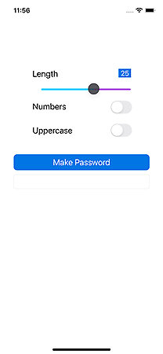

#  iOS basic password generator demo

* A slider to set the length of password
* A toggle to enable 5 randomly generated numbers
* A toggle to enable a minimum of 3 uppercase characters and a max of half the length selected by the slider

The logic was simple enough, but getting the interface working was a bit of an issue.
Xcode 13 seems to have a bug for locking the orientation in the target general settings checkboxes. I had to go to the build settings plist settings to fix.

